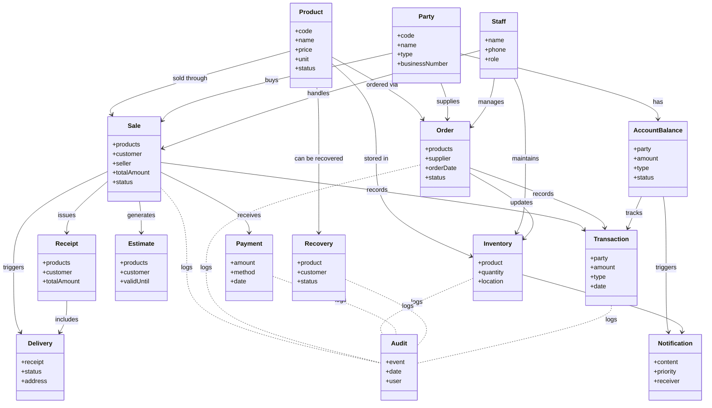

# Simon

**S**ales and **I**nventory **M**anagement m**ON**ster

## Description

Simon은 사용자가 판매 및 재고를 관리할 수 있는 서비스입니다.

## Usage

### Project setup

```bash
$ pnpm install
```

### Compile and run the project

```bash
# development
$ pnpm run start

# watch mode
$ pnpm run start:dev

# production mode
$ pnpm run start:prod
```

### Run tests

```bash
# unit tests
$ pnpm run test

# e2e tests
$ pnpm run test:e2e

# test coverage
$ pnpm run test:cov
```

## Architecture

Simon은 다음과 같은 기술을 사용하여 구현되어 있습니다.

- **NestJS**: Node.js 프레임워크로 Simon의 서버를 구현합니다.
- **TypeORM**: TypeScript ORM으로 Simon의 데이터베이스를 구현합니다.
- **PostgreSQL**: Simon의 데이터베이스로 사용합니다.

## Domain

[도메인 위키](https://github.com/GrassHopper42/simon-backend/wiki/Domain)



## ERD


